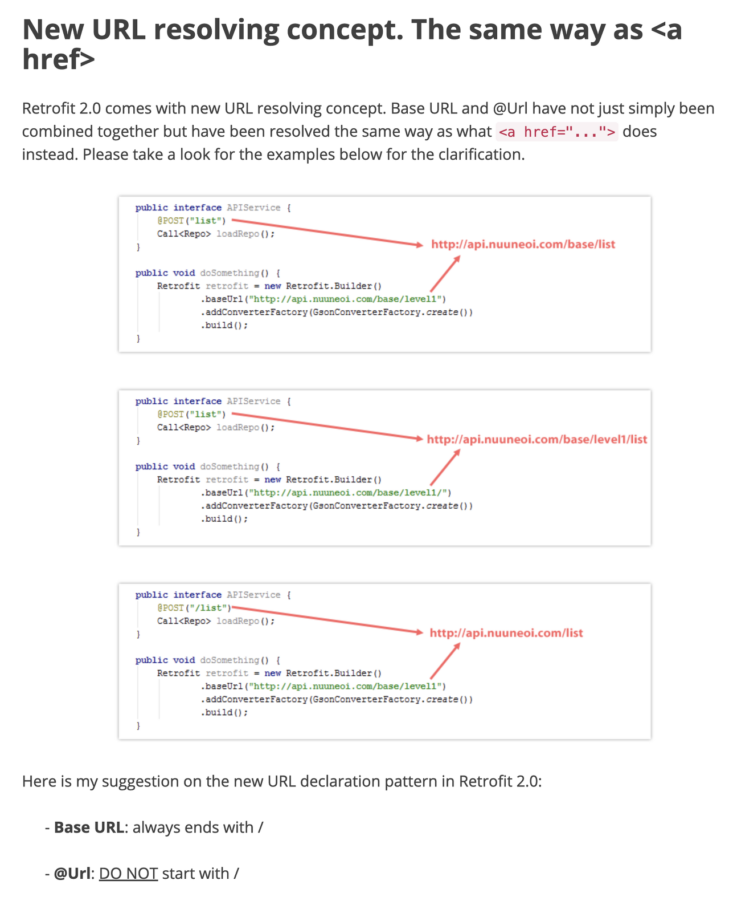

# Internal
어플리케이션 호출 진입점으로 InternalService 는 Retrofit을 이용하여 외부 http를 호출  

# External
외부 서버라고 생각하면 되고 간단한 Person 객체 정보를 리턴한다.

# Retrofit
사용할 REST API 목록을 기술하고 RetrofitUtil 을 통해 기본 URL과 서비스 등록 및 sync, async를 처리할 수 있는 함수를 생성한다.  

**중요**
BASE_URL 은 반드시 '/' 로 끝나야 한다. 아니면 아래와 같은 에러가 발생
> Caused by: java.lang.IllegalArgumentException: baseUrl must end in /

그래서 REST API를 등록할 때는 반드시 '/' 로 시작하지 말아야한다.
> @GET("persons")
> Call<List<Person>> getPersonList();

스프링의 Rest 는 크게 구분이 없어도 동작하지만 Retrofit 은 규약을 지켜야 한다.

